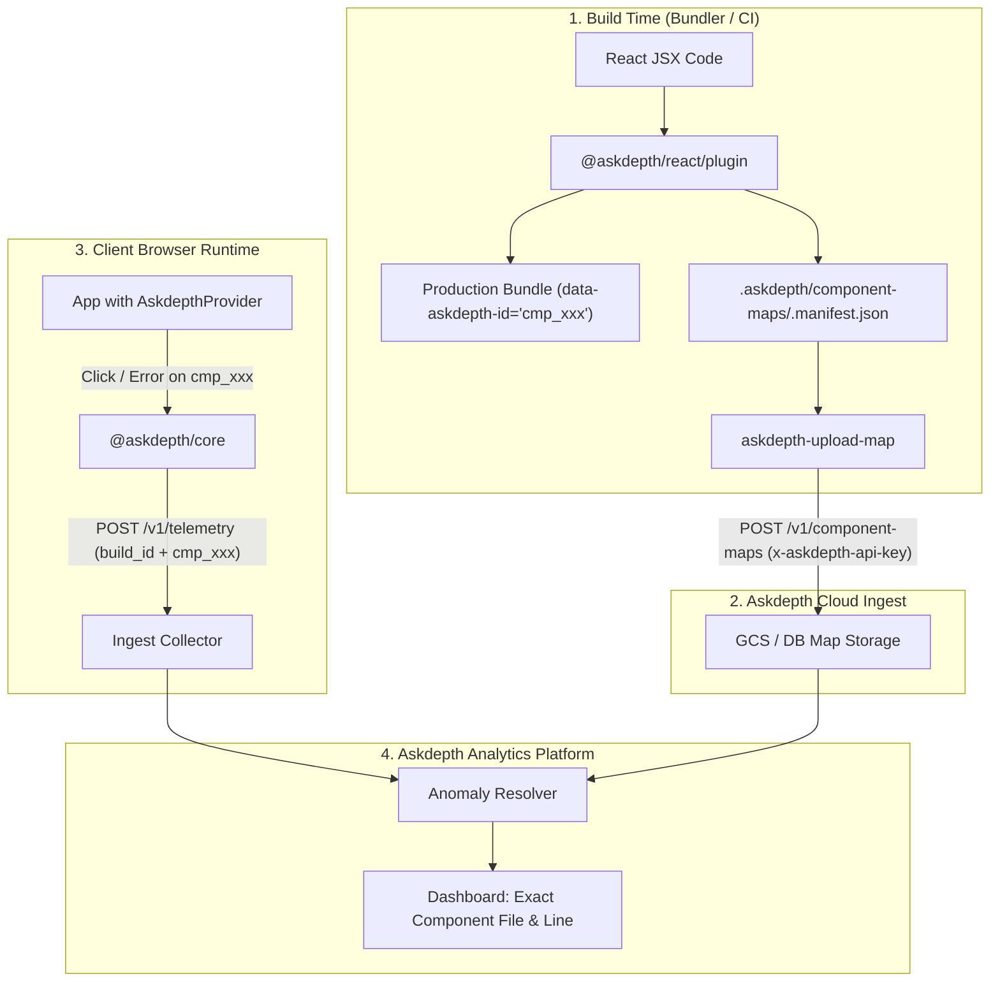

# Askdepth Component Mapping & Build ID Pipeline

This document describes how Askdepth connects build-time JSX component mapping to runtime telemetry and cloud ingestion for accurate error and frustration tracking without leaking source code in production.

---

## 1. Overview & Privacy Model

In modern frontend applications, correlating a runtime error or user frustration (such as a rage click or dead click) back to the exact source component file, line, and column is critical for rapid debugging.

However, exposing raw file paths like `src/components/checkout/PaymentForm.tsx:142:10` inside production HTML attributes (`data-askdepth-src`) exposes internal directory structures, filenames, and component hierarchy to anyone inspecting the DOM.

To preserve privacy while maintaining complete source attribution:

1. **Development & Staging:**
   The compiler plugin stamps JSX elements with human-readable source locations:
   ```html
   <button data-askdepth-src="src/components/Button.tsx:42:10">Pay</button>
   ```

2. **Production:**
   The compiler plugin hashes the location using a deterministic SHA-256 slice (8 hex characters) prefixed with `cmp_`:
   ```html
   <button data-askdepth-id="cmp_a8f9c123">Pay</button>
   ```
   No file paths or line numbers are included in the client bundle.

3. **Private Component Manifest:**
   During the production build, the compiler creates a private lookup manifest:
   ```json
   {
     "build_id": "v1.4.2-a81d3f",
     "created_at": "2026-10-02T12:00:00.000Z",
     "mappings": {
       "cmp_a8f9c123": {
         "file": "src/components/Button.tsx",
         "line": 42,
         "col": 10,
         "component_name": "Button"
       }
     }
   }
   ```
   This manifest is saved locally to `.askdepth/component-maps/<buildId>.manifest.json`.

4. **Manifest Ingestion:**
   In your CI/CD pipeline, the manifest is securely uploaded to the Askdepth Ingest API (`POST /v1/component-maps`).

5. **Runtime Telemetry Correlation:**
   The runtime SDK transmits the active `build_id` in telemetry envelopes (`x-askdepth-build-id`). When an anomaly or error occurs on an element with `data-askdepth-id="cmp_a8f9c123"`, the Askdepth platform maps `(build_id, cmp_a8f9c123)` back to `src/components/Button.tsx:42:10`.

---

## 2. End-to-End Architecture



---

## 3. Bundler Integration

Install `@askdepth/react` and `@askdepth/core`:

```bash
pnpm add @askdepth/react @askdepth/core
```

### Next.js

Wrap your Next.js configuration using `withAskdepth`:

```js
// next.config.mjs
import { withAskdepth } from '@askdepth/react/plugin';

/** @type {import('next').NextConfig} */
const nextConfig = {
  reactStrictMode: true,
};

export default withAskdepth(nextConfig);
```

For **Turbopack** (Next.js 15+), `withAskdepth` automatically registers `@askdepth/react/turbopack-loader` for `*.tsx` and `*.jsx` files under `experimental.turbo.rules`.

### Vite

```ts
// vite.config.ts
import { defineConfig } from 'vite';
import react from '@vitejs/plugin-react';
import { askdepthVitePlugin } from '@askdepth/react/plugin';

export default defineConfig({
  plugins: [
    react(),
    askdepthVitePlugin({
      environment: process.env.NODE_ENV,
    }),
  ],
});
```

### Webpack & Rspack

```ts
// Webpack
import { askdepthWebpackPlugin } from '@askdepth/react/plugin';

// In webpack config plugins:
plugins: [
  askdepthWebpackPlugin({ environment: process.env.NODE_ENV }),
]

// Rspack
import { askdepthRspackPlugin } from '@askdepth/react/plugin';

plugins: [
  askdepthRspackPlugin({ environment: process.env.NODE_ENV }),
]
```

---

## 4. Build ID Detection

The plugin automatically detects the build identifier using the following precedence:

1. `options.buildId` (explicit plugin option)
2. `process.env.ASKDEPTH_BUILD_ID`
3. `process.env.VERCEL_GIT_COMMIT_SHA`
4. `process.env.NEXT_PUBLIC_VERCEL_GIT_COMMIT_SHA`
5. `process.env.GITHUB_SHA`
6. `process.env.BUILD_ID`
7. Fallback to `local-${process.pid}` (for local builds)

---

## 5. Runtime SDK Configuration

To ensure runtime telemetry envelopes contain the matching `build_id`, supply it to `<AskdepthProvider>` or `Askdepth.init(...)`:

### In React / Next.js:

```tsx
'use client';

import { AskdepthProvider } from '@askdepth/react';

export function Providers({ children }: { children: React.ReactNode }) {
  return (
    <AskdepthProvider
      writeKey={process.env.NEXT_PUBLIC_ASKDEPTH_WRITE_KEY!}
      endpoint={process.env.NEXT_PUBLIC_ASKDEPTH_ENDPOINT!}
      consent="granted"
      buildId={process.env.NEXT_PUBLIC_VERCEL_GIT_COMMIT_SHA ?? process.env.NEXT_PUBLIC_ASKDEPTH_BUILD_ID}
    >
      {children}
    </AskdepthProvider>
  );
}
```

> **Note:** If `buildId` is not explicitly passed to `<AskdepthProvider>`, it automatically falls back to `process.env.NEXT_PUBLIC_VERCEL_GIT_COMMIT_SHA` and `process.env.NEXT_PUBLIC_ASKDEPTH_BUILD_ID`.

### In Vanilla TypeScript (`@askdepth/core`):

```typescript
import { Askdepth } from '@askdepth/core';

Askdepth.init({
  writeKey: 'your_write_key',
  endpoint: 'https://in.askdepth.com',
  consent: 'granted',
  buildId: 'git-commit-sha-or-release-tag',
});
```

When configured, `@askdepth/core` sends:
- HTTP Header: `x-askdepth-build-id: <buildId>`
- Envelope Payload: `"build_id": "<buildId>"`

---

## 6. Upload CLI (`askdepth-upload-map`)

The package `@askdepth/react` includes a standalone CLI binary: `askdepth-upload-map`.

### Syntax

```bash
askdepth-upload-map [options]
```

### Options Reference

| Option | Shorthand | Environment Variable | Default | Description |
|---|---|---|---|---|
| `--endpoint <url>` | `-e` | `ASKDEPTH_INGEST_URL` | `https://in.askdepth.com` | Askdepth Ingest endpoint URL |
| `--api-key <key>` | `-k`, `--write-key` | `ASKDEPTH_API_KEY` or `ASKDEPTH_WRITE_KEY` | *(Required)* | Project API key or write key |
| `--build-id <id>` | `-b` | `ASKDEPTH_BUILD_ID`, `GITHUB_SHA`, `VERCEL_GIT_COMMIT_SHA` | Auto-detected | Specific build ID to upload |
| `--dir <path>` | `-d` | `ASKDEPTH_COMPONENT_MAP_DIR` | `./.askdepth/component-maps` | Directory containing component maps |
| `--help` | `-h` | | | Display CLI help and usage message |

---

## 7. CI/CD Integration

### Option A: `package.json` (`postbuild` hook)

The most transparent way to upload mappings without modifying CI scripts:

```json
{
  "scripts": {
    "build": "next build",
    "postbuild": "askdepth-upload-map"
  }
}
```

Ensure `ASKDEPTH_API_KEY` and `ASKDEPTH_INGEST_URL` are configured in your deployment environment variables.

### Option B: GitHub Actions

```yaml
name: Deploy

on:
  push:
    branches: [main]

jobs:
  deploy:
    runs-on: ubuntu-latest
    steps:
      - uses: actions/checkout@v4
      - uses: pnpm/action-setup@v3
      - uses: actions/setup-node@v4
        with:
          node-version: 20
          cache: 'pnpm'

      - run: pnpm install --frozen-lockfile

      - name: Build Application
        run: pnpm build
        env:
          NODE_ENV: production
          ASKDEPTH_BUILD_ID: ${{ github.sha }}

      - name: Upload Component Map
        run: npx askdepth-upload-map
        env:
          ASKDEPTH_API_KEY: ${{ secrets.ASKDEPTH_API_KEY }}
          ASKDEPTH_INGEST_URL: https://in.askdepth.com
          ASKDEPTH_BUILD_ID: ${{ github.sha }}
```

### Option C: GitLab CI

```yaml
stages:
  - build

build_and_upload_map:
  stage: build
  image: node:20
  script:
    - pnpm install --frozen-lockfile
    - pnpm build
    - npx askdepth-upload-map
  variables:
    NODE_ENV: "production"
    ASKDEPTH_BUILD_ID: "$CI_COMMIT_SHA"
    ASKDEPTH_API_KEY: "$ASKDEPTH_API_KEY"
    ASKDEPTH_INGEST_URL: "https://in.askdepth.com"
```

### Option D: Vercel

1. In the Vercel Dashboard, go to **Project Settings** > **Environment Variables**.
2. Add:
   - `ASKDEPTH_API_KEY`: Your project write key or API key.
   - `ASKDEPTH_INGEST_URL`: `https://in.askdepth.com` (or your ingestion URL).
3. In `package.json`, set `"postbuild": "askdepth-upload-map"`.
4. Vercel automatically exposes `VERCEL_GIT_COMMIT_SHA`, which both the compiler plugin and the upload tool automatically use as the `build_id`.
